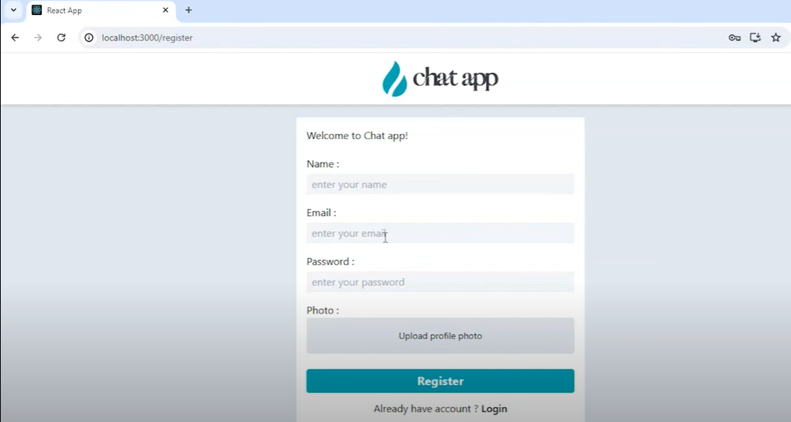

# Chat Application

This is a real-time chat application built with a **React** frontend and an **Express.js** backend, utilizing **Socket.io** for instant messaging capabilities.


## Overview

This chat application features:

- Real-time messaging using Socket.io
- Secure user authentication with JWT
- Responsive design with Tailwind CSS
- State management with Redux
- Backend and database management with Express and MongoDB

## Project Structure

The application consists of two main components:

1. **Frontend (React)**  
   The client-side application built with React, Redux, and Tailwind CSS for a modern, responsive chat interface.

2. **Backend (Express)**  
   The server-side API built with Express and MongoDB for managing user data, authentication, and real-time messaging.

## Technologies Used

- **Frontend:** React, Redux, React Router, Tailwind CSS, Axios, Socket.io-client
- **Backend:** Node.js, Express.js, Mongoose, Socket.io
- **Database:** MongoDB
- **Authentication:** JWT and bcryptjs for secure user sessions

## Screenshots

Here are some screenshots of the application interface:

1. 
2. 
3. 
4. 

## Project Setup and Installation

To run the project locally, follow these steps:

1. **Clone the Repository**

   ```bash
   git clone https://github.com/your-username/chat-app.git
   cd chat-app
   ```

2. **Install Backend Dependencies**

   ```bash
   cd server
   npm install
   ```

3. **Install Frontend Dependencies**

   ```bash
   cd client
   npm install
   ```

4. **Run the Application**

   - To start the backend server:
     ```bash
     cd server
     npm run dev
     ```

   - To start the frontend:
     ```bash
     cd client
     npm start
     ```

## Folder Structure

```bash
├── client/
│   ├── src/
│   │   ├── components/
│   │   ├── redux/
│   │   ├── App.js
│   │   └── index.js
│   └── package.json
├── server/
│   ├── models/
│   ├── routes/
│   ├── controllers/
│   ├── config/
│   └── index.js
└── README.md
```

## License

This project is licensed under the MIT License. See the [LICENSE](LICENSE) file for details.

--- 
